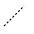
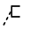

# 功能介绍

## 登录

根据UAP BPM安装手册安装工作流产品，打开浏览器，输入工作流产品的URL(http://机器名:端口号/ ubpm-web-process-center2)，输入用户名和密码登录，默认的用户名为admin，密码也是admin。

图：UAP BPM登录画面

## 流程设计工作区

登录后,点击模型菜单，选中模型菜单对应目录下的某条流程定义，点击设计按钮，进入流程设计界面。

点击画面左边的目录节点，画面右面展示选中的流程设计图：

图：流程设计工作区画面

模型菜单列表右上角的按钮介绍如下：

新建：新建模型并进入流程设计面板；

导入：可导入离线设计好的BPMN文件或XML文件；

编辑：打开选中的模型，进入流程设计面板可再次编辑；

设计：点击设计进入流程设计器界面，可设计流程图；

复制：复制成一个新的模型；

删除：删除选中的模型；

导出：把模型导出，保存成XML文件；

部署：发布流程，发布后的流程可以启动流程实例；

## 新建模型

点击右上角的“新增”按钮，从右侧推出新增模型画面：

图：流程名称定义画面

名称框中输入流程定义的名称，说明框中输入对流程的说明文字。点击“保存”按钮跳转到流程设计界面。

## 流程设计面板

图：流程设计面板画面

### 控件区

画板的左边是控件区，包含了流程定义所需的启动事件、活动、网关、事件、结束、连接、工件控件。用鼠标把控件拖到中间的绘制区进行流程图设计。

UAP BPM系统有以下控件：

<table> 
   <tbody> 
    <tr> 
     <td> 
 No. 
 </td> 
     <td> 
 图标 
 </td> 
     <td> 
 控件名称 
 </td> 
     <td> 
 描述 
 </td> 
    </tr> 
    <tr> 
     <td> 
 1 
 </td> 
     <td> 
 
 </td> 
     <td> 
 启动 
 </td> 
     <td> 
 不指定启动流程实例的触发条件。该元素用于当流程实例要通过API启动的场景 
 </td> 
    </tr> 
    <tr> 
     <td> 
 2 
 </td> 
     <td> 
 
 </td> 
     <td> 
 定时启动 
 </td> 
     <td> 
 定时启动用来在指定的时间创建流程实例 
 </td> 
    </tr> 
    <tr> 
     <td> 
 3 
 </td> 
     <td> 
 
 </td> 
     <td> 
 错误启动 
 </td> 
     <td> 
 错误启动可以用来触发一个事件子流程，错误启动不能用来启动流程实例 
 </td> 
    </tr> 
    <tr> 
     <td> 
 4 
 </td> 
     <td> 
 
 </td> 
     <td> 
 用户任务 
 </td> 
     <td> 
 用户任务用来设置必须由人员完成的工作。 当流程执行到用户任务，会创建一个新任务， 并把这个新任务加入到分配人或群组的任务列表中 
 </td> 
    </tr> 
    <tr> 
     <td> 
 5 
 </td> 
     <td> 
 
 </td> 
     <td> 
 脚本任务 
 </td> 
     <td> 
 脚本任务是一个自动节点。当流程到达脚本任务，会自动执行对应的脚本 
 </td> 
    </tr> 
    <tr> 
     <td> 
 6 
 </td> 
     <td> 
 
 </td> 
     <td> 
 服务任务 
 </td> 
     <td> 
 服务任务用来调用外部java类 
 </td> 
    </tr> 
    <tr> 
     <td> 
 7 
 </td> 
     <td> 
 
 </td> 
     <td> 
 邮件任务 
 </td> 
     <td> 
 支持自动邮件任务，它可以发送邮件给一个或多个参与者 
 </td> 
    </tr> 
    <tr> 
     <td> 
 8 
 </td> 
     <td> 
 
 </td> 
     <td> 
 手工任务 
 </td> 
     <td> 
 表示工作需要某人完成，而引擎不需要知道，也没有对应的系统和UI接口 
 </td> 
    </tr> 
    <tr> 
     <td> 
 9 
 </td> 
     <td> 
 
 </td> 
     <td> 
 接受任务 
 </td> 
     <td> 
 接收任务是一个简单任务，它会等待对应消息的到达。 当前，我们只实现了这个任务的java语义。 当流程达到接收任务，流程状态会保存到存储里。 意味着流程会等待在这个等待状态， 直到引擎接收了一个特定的消息， 这会触发流程穿过接收任务继续执行 
 </td> 
    </tr> 
    <tr> 
     <td> 
 10 
 </td> 
     <td> 
 
 </td> 
     <td> 
 业务规则任务 
 </td> 
     <td> 
 业务规则用户用来同步执行一个或多个规则 
 </td> 
    </tr> 
    <tr> 
     <td> 
 11 
 </td> 
     <td> 
 
 </td> 
     <td> 
 事件子流程 
 </td> 
     <td> 
 由事件触发的子流程 
 </td> 
    </tr> 
    <tr> 
     <td> 
 12 
 </td> 
     <td> 
 
 </td> 
     <td> 
 子流程 
 </td> 
     <td> 
 是一个包含其他节点，网关，事件等等的节点。 它自己就是一个流程，同时是更大流程的一部分。 子流程是完全定义在父流程里的 
 </td> 
    </tr> 
    <tr> 
     <td> 
 13 
 </td> 
     <td> 
 
 </td> 
     <td> 
 调用活动 
 </td> 
     <td> 
 引用流程定义外部的一个流程 
 </td> 
    </tr> 
    <tr> 
     <td> 
 14 
 </td> 
     <td> 
 
 </td> 
     <td> 
 并行网关 
 </td> 
     <td> 
 将流程分成多条分支，也可以把多条分支 汇聚到一起。如果同一个并行网关有多个进入或多个外出顺序流，它就同时具有分支和汇聚功能，并行网关不会解析条件，即使顺序流上定义了条件也会被忽略 
 </td> 
    </tr> 
    <tr> 
     <td> 
 15 
 </td> 
     <td> 
 
 </td> 
     <td> 
 独占网关 
 </td> 
     <td> 
 当流程执行到这个网关，所有外出顺序流都会被处理一遍。 其中条件解析为true的第一个顺序流（或者没有设置条件，概念上在顺序流上定义了一个'true'） 会被选中，让流程继续运行。即使有多个返回值为true的顺序流但流程依然只走第一个 
 </td> 
    </tr> 
    <tr> 
     <td> 
 16 
 </td> 
     <td> 
 
 </td> 
     <td> 
 包含网关 
 </td> 
     <td> 
 是独占网关和并行网关的结合体。和独占网关一样，可以在外出顺序流上定义条件，包含网关会解析它们。 但是主要的区别是包含网关可以选择多于一条顺序流，这和并行网关一样 
 </td> 
    </tr> 
    <tr> 
     <td> 
 17 
 </td> 
     <td> 
 
 </td> 
     <td> 
 事件网关 
 </td> 
     <td> 
 允许根据事件判断流向。网关的每个外出顺序流都要连接到一个中间捕获事件。 当流程到达一个基于事件网关，网关会进入等待状态：会暂停执行。 与此同时，会为每个外出顺序流创建相对的事件订阅 
 </td> 
    </tr> 
    <tr> 
     <td> 
 18 
 </td> 
     <td> 
 
 </td> 
     <td> 
 定时器边界事件 
 </td> 
     <td> 
 一个暂停等待警告的时钟。当流程执行到绑定了边界事件的环节， 会启动一个定时器。 当定时器触发时（比如，一定时间之后），环节就会中断， 并沿着定时边界事件的外出连线继续执行 
 </td> 
    </tr> 
    <tr> 
     <td> 
 19 
 </td> 
     <td> 
 
 </td> 
     <td> 
 错误边界事件 
 </td> 
     <td> 
 定义一个边界错误事件，大多用于内嵌子流程， 或调用节点，对于子流程的情况，它会为所有内部的节点创建一个作用范围。 错误是由错误结束事件抛出的。 这个错误会传递给上层作用域，直到找到一个错误事件定义向匹配的边界错误事件 
 </td> 
    </tr> 
    <tr> 
     <td> 
 20 
 </td> 
     <td> 
 
 </td> 
     <td> 
 信号边界事件 
 </td> 
     <td> 
 节点边界的中间捕获信号，它会捕获信号定义引用的相同信号名的信号 
 </td> 
    </tr> 
    <tr> 
     <td> 
 21 
 </td> 
     <td> 
 
 </td> 
     <td> 
 消息边界事件 
 </td> 
     <td> 
 捕获信号定义引用的相同信号名的信号 
 </td> 
    </tr> 
    <tr> 
     <td> 
 22 
 </td> 
     <td> 
 
 </td> 
     <td> 
 补偿边界事件 
 </td> 
     <td> 
 在节点的边界捕获补偿，用来设置一个节点的补偿处理器 
 </td> 
    </tr> 
    <tr> 
     <td> 
 23 
 </td> 
     <td> 
 
 </td> 
     <td> 
 定时器中间事件（捕获） 
 </td> 
     <td> 
 定时中间事件作为一个监听器。当执行到达捕获事件节点， 就会启动一个定时器。 当定时器触发（比如，一段时间之后），流程就会沿着定时中间事件的外出节点继续执行 
 </td> 
    </tr> 
    <tr> 
     <td> 
 24 
 </td> 
     <td> 
 
 </td> 
     <td> 
 信号中间事件（捕获） 
 </td> 
     <td> 
 通过引用信号定义来捕获相同信号名称的信号 
 </td> 
    </tr> 
    <tr> 
     <td> 
 25 
 </td> 
     <td> 
 
 </td> 
     <td> 
 消息中间事件（捕获） 
 </td> 
     <td> 
 一个中间捕获消息事件，捕获特定名称的消息 
 </td> 
    </tr> 
    <tr> 
     <td> 
 26 
 </td> 
     <td> 
 
 </td> 
     <td> 
 信号中间事件（抛掷） 
 </td> 
     <td> 
 定义的信号抛出一个信号事件 
 </td> 
    </tr> 
    <tr> 
     <td> 
 27 
 </td> 
     <td> 
 
 </td> 
     <td> 
 补偿中间事件 
 </td> 
     <td> 
 中间触发补偿事件 可以用来触发补偿 
 </td> 
    </tr> 
    <tr> 
     <td> 
 28 
 </td> 
     <td> 
 
 </td> 
     <td> 
 结束事件 
 </td> 
     <td> 
 表示（子）流程（分支）的结束 
 </td> 
    </tr> 
    <tr> 
     <td> 
 29 
 </td> 
     <td> 
 
 </td> 
     <td> 
 错误结束事件 
 </td> 
     <td> 
 当流程执行到错误结束事件，流程的当前分支就会结束，并抛出一个错误 
 </td> 
    </tr> 
    <tr> 
     <td> 
 30 
 </td> 
     <td> 
 
 </td> 
     <td> 
 终止结束事件 
 </td> 
     <td> 
 当到达终止结束事件时，终止事件 
 </td> 
    </tr> 
    <tr> 
     <td> 
 31 
 </td> 
     <td> 
 
 </td> 
     <td> 
 顺序流 
 </td> 
     <td> 
 顺序流是连接两个流程节点的连线。 流程执行完一个节点后，会沿着节点的所有外出顺序流继续执行 
 </td> 
    </tr> 
    <tr> 
     <td> 
 32 
 </td> 
     <td> 
 
 </td> 
     <td> 
 关联 
 </td> 
     <td> 
 把控件关联起来 
 </td> 
    </tr> 
    <tr> 
     <td> 
 33 
 </td> 
     <td> 
 
 </td> 
     <td> 
 注释 
 </td> 
     <td> 
 说明文字 
 </td> 
    </tr> 
    <tr> 
     <td> 
 34 
 </td> 
     <td> 
 
 </td> 
     <td> 
 审批任务 
 </td> 
     <td> 
 审批任务用来设置由用户，用户组或部门下的用户来完成的工作。 当流程执行到审批任务，会创建多个新任务， 并把新任务加入到分配用户或用户组后部门下用户的任务列表中 
 </td> 
    </tr> 
    <tr> 
     <td> 
 35 
 </td> 
     <td> 
 
 </td> 
     <td> 
 中间事件（抛掷) 
 </td> 
     <td> 
 中间抛掷事件 
 </td> 
    </tr> 
   </tbody> 
  </table>

表：UAP BPM控件

各控件的具体说明请参考《控件说明》章节。

### 属性区

画板的右边是属性区，可以设置流程的属性和控件的各种属性，控件的属性请参考《控件说明》章节。

### 功能区

画板的上方是功能区，可以保存流程图，剪切、复制，粘贴、删除控件，恢复、撤销操作，垂直对齐、水平对齐控件，把相同类型的多个控件设成相同大小，放大、缩小、还原控件，让控件适应窗口，为选中的顺序流增加弯曲顶点、移除选中的顺序流上的弯曲顶点。

<table> 
   <tbody> 
    <tr> 
     <td> 
 No 
 </td> 
     <td> 
 图标 
 </td> 
     <td> 
 名称 
 </td> 
     <td> 
 描述 
 </td> 
     <td> 
 备注 
 </td> 
    </tr> 
    <tr> 
     <td> 
 1 
 </td> 
     <td> 
 
 </td> 
     <td> 
 保存模型 
 </td> 
     <td> 
 弹出保存模型对话框，点击“保存”则保存流程图但不退出，点击“保存并关闭设计器”则保存流程图，跳转到流程设计工作区画面。 
 </td> 
     <td> 

 </td> 
    </tr> 
    <tr> 
     <td> 
 2 
 </td> 
     <td> 
 
 </td> 
     <td> 
 剪切 
 </td> 
     <td> 
 剪切选中的一个或多个控件 
 </td> 
     <td> 

 </td> 
    </tr> 
    <tr> 
     <td> 
 3 
 </td> 
     <td> 
 
 </td> 
     <td> 
 复制 
 </td> 
     <td> 
 复制选中的一个或多个控件 
 </td> 
     <td> 
 Crtl + C键实现同样的效果 
 </td> 
    </tr> 
    <tr> 
     <td> 
 4 
 </td> 
     <td> 
 
 </td> 
     <td> 
 粘贴 
 </td> 
     <td> 
 粘贴选中的一个或多个控件 
 </td> 
     <td> 
 Crtl + V键实现同样的效果 
 </td> 
    </tr> 
    <tr> 
     <td> 
 5 
 </td> 
     <td> 
 
 </td> 
     <td> 
 删除 
 </td> 
     <td> 
 删除选中的一个或多个控件 
 </td> 
     <td> 
 Delete键实现同样的效果 
 </td> 
    </tr> 
    <tr> 
     <td> 
 6 
 </td> 
     <td> 
 
 </td> 
     <td> 
 恢复 
 </td> 
     <td> 
 恢复上一个操作 
 </td> 
     <td> 
 Crtl + Y键实现同样的效果 
 </td> 
    </tr> 
    <tr> 
     <td> 
 7 
 </td> 
     <td> 
 
 </td> 
     <td> 
 撤销 
 </td> 
     <td> 
 撤销上一个操作 
 </td> 
     <td> 
 Crtl + Z键实现同样的效果 
 </td> 
    </tr> 
    <tr> 
     <td> 
 8 
 </td> 
     <td> 
 
 </td> 
     <td> 
 垂直对齐 
 </td> 
     <td> 
 垂直对齐选中的多个控件 
 </td> 
     <td> 

 </td> 
    </tr> 
    <tr> 
     <td> 
 9 
 </td> 
     <td> 
 
 </td> 
     <td> 
 水平对齐 
 </td> 
     <td> 
 水平对齐选中的多个控件 
 </td> 
     <td> 

 </td> 
    </tr> 
    <tr> 
     <td> 
 10 
 </td> 
     <td> 
 
 </td> 
     <td> 
 相同大小 
 </td> 
     <td> 
 按最大的尺寸，把选中的同一类型的控件统一设成相同大小 
 </td> 
     <td> 

 </td> 
    </tr> 
    <tr> 
     <td> 
 11 
 </td> 
     <td> 
 
 </td> 
     <td> 
 放大 
 </td> 
     <td> 
 放大中央绘制区，控件随之放大 
 </td> 
     <td> 

 </td> 
    </tr> 
    <tr> 
     <td> 
 12 
 </td> 
     <td> 
 
 </td> 
     <td> 
 缩小 
 </td> 
     <td> 
 缩小中央绘制区，控件随之缩小 
 </td> 
     <td> 

 </td> 
    </tr> 
    <tr> 
     <td> 
 13 
 </td> 
     <td> 
 
 </td> 
     <td> 
 实际大小 
 </td> 
     <td> 
 还原中央绘制区，控件回到初始大小 
 </td> 
     <td> 

 </td> 
    </tr> 
    <tr> 
     <td> 
 14 
 </td> 
     <td> 
 
 </td> 
     <td> 
 适应窗口 
 </td> 
     <td> 
 以合适的大小显示中央绘制区 
 </td> 
     <td> 

 </td> 
    </tr> 
    <tr> 
     <td> 
 15 
 </td> 
     <td> 
 
 </td> 
     <td> 
 为选中的顺序流增加弯曲顶点 
 </td> 
     <td> 
 在顺序流线上增加弯曲顶点，拖动弯曲顶点可以改变线的弯曲 
 </td> 
     <td> 

 </td> 
    </tr> 
    <tr> 
     <td> 
 16 
 </td> 
     <td> 
 
 </td> 
     <td> 
 移除选中的顺序流增加弯曲顶点 
 </td> 
     <td> 
 移除选中的顺序流上的弯曲顶点，可以把弯曲线恢复成直线 
 </td> 
     <td> 

 </td> 
    </tr> 
   </tbody> 
  </table>

表：面板的功能按钮介绍

## 控件的使用

### 改变位置和大小

把控件拖到绘制区，在绘制区还可以通过拖动再次调整控件的位置。

对于活动，连接，工件控件，还可以调整控件的大小。

图：改变控件大小位置图

### 连接控件

点击控件，在控件的周边会出现常用控件图标，点击图标就会添加控件并自动连上线，如下图：

图：点击控件效果图

点击用户任务控件后的效果图：

图：点击用户任务控件效果图

也可从控件区拖动控件和连接线，手动连接两个控件。

控件连接后，拖动控件时，连接线会自动改变形状，如果不理想，还可手动调整连接线的形状。

图：调整连接线的形状图

### 设置属性

不选中控件时，可设置流程模型的ID，名称，说明和命名空间等。

图：流程模型属性设计图

选中控件时，在属性区设置控件的ID，名称，说明等属性。控件的名称要简明，并能出直观的反映控件的功能。

图：属性设计图

### 请假的流程图例

下面定义一个简单的请假流程例子。

根据请假的天数，有不同权限的人员审核，业务规则是：

请假1到2天，由项目经理审批，

请假3到5天，由部门经理审批，

请假5天以上，由董事长审批。

不批准时，通过邮件通知申请人。

要用到启动、顺序流、独占网关、用户任务、邮件任务、结束，最终的流程图如下:

图：请假流程图

步骤一：拖动启动控件到中央绘制区，点击图标周边的独占网关图标。

图：启动和网关示意图

步骤二：点击独占网关周边的用户任务图标，点出三个任务图标。

图：任务示意图

步骤三：调整顺序流线，用功能区的垂直对齐功能使三个用户任务对齐。

图：调整连接线图

步骤四：根据业务给顺序流线设上流转条件、改用户任务的名称属性。

点击下图右边属性里的条件框，弹出顺序流条件对话框。

图：顺序流的属性图

顺序流条件对话框中输入流程运行时的判断条件，请假天数变量为holidayDays，则表达式为：${holidayDays> 1 &&holidayDays<= 2}。

同理，在顺序流的名称框里输入“请假1到2天”。

图：顺序流条件对话框

结果如下：

图：输入名称和设置网关的流转条件

设置剩余顺序流和用户任务的名称和流转条件。

图：输入名称和设置网关的流转条件图

步骤五：添加邮件任务、结束控件，并用顺序流把它们连接起来。

图：添加邮件任务和结束图

步骤六：设置顺序流的名称和批准的流转条件，设置邮件任务的名称和邮件属性。

图：不批准的流转条件图

图：邮件属性设置图

图：最终的请假流程图

步骤七：保存请假流程图，可以在描述框里追加描述。点保存并关闭设计器后，回到流程一览画面。

图：保存请假流程图

## 修改流程图

在流程设计工作区，选中要修改的流程图，点击“编辑”按钮，则跳转到流程设计画面，可修改流程图。

图：流程设计画面

## 部署

把流程模型作为一个流程发布到工作流系统中。

在部署节点对应的目录列表中可找到部署的流程图。部署后，会生成相应的流程部署图和流程定义的xml，点击行记录中的“部署资源”可进行查看；

可点击“转换为模型”按钮将部署的流程定义转成流程模型，同时也可以通过选择本地已经存在的流程xml或.bpmn文件直接部署，部署后即可用来启动流程实例。

 

